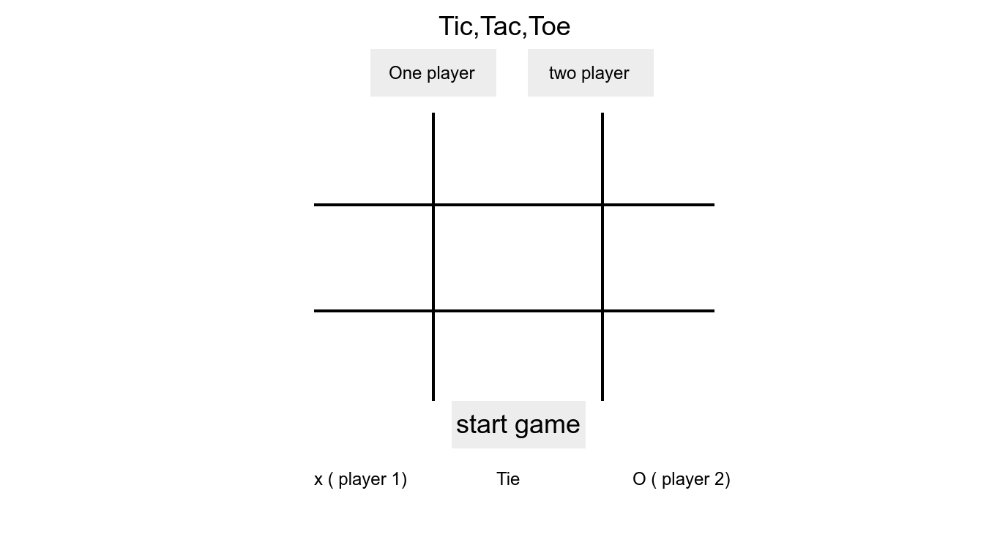

# Project-1  - Tic Tac Toe

## Descripition

  The game is tic tac toe , you can select one player and play with computer or two players , you can play multiple game roundes and know who is win or tie .
  
## Technologies

- html .
- css .
- java script .

## user stories

- As a user, I should be able to start a new tic tac toe game
- As a user, I should be able to click on a square to add X first and then O, and so on
- As a user, I should be shown a message after each turn for if I win, lose, tie or who's turn it is next
- As a user, I should not be able to click the same square twice
- As a user, I should be shown a message when I win, lose or tie
- As a user, I should not be able to continue playing once I win, lose, or tie
- As a user, I should be able to play the game again without refreshing the page
- As a user , I can play multiple game roundes and know if I win or tie
- As a user , I can select one player and play with computer
- As a user , I can use the website from a mobile phone

## planning and development process

  Start with html and css pages after that start in  java script page .
  After link all pages togather start develpment , First start if the game for two players ( play game , find the winner , count the number of winner times or tie  and if select play again the game will restart ) after that devlopment if select one player game ( play with computer ) at same steps.

## Code Examples

### the winner funcition

``` java
if ((XOrOList[0] != null) && (XOrOList[1] != null) && (XOrOList[2] != null) && (XOrOList[0] === XOrOList[1]) && (XOrOList[0] === XOrOList[2])) {
        removeAllEvent();
       MessageWin();
    }
   ```

if the element of the same line (example) have the same value and not null , upload message win and remove all events listener to stop clicks in games .

## Usage

first select one player or two player ---> then click play game image to start the game ---> select any element and play ---> if you want to start again click at start again image .

## wireframe


